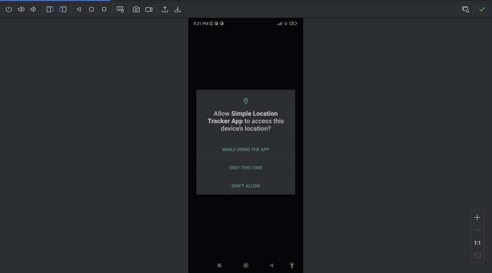
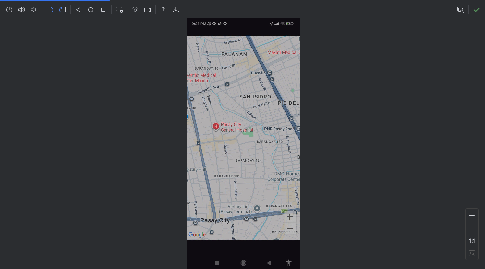
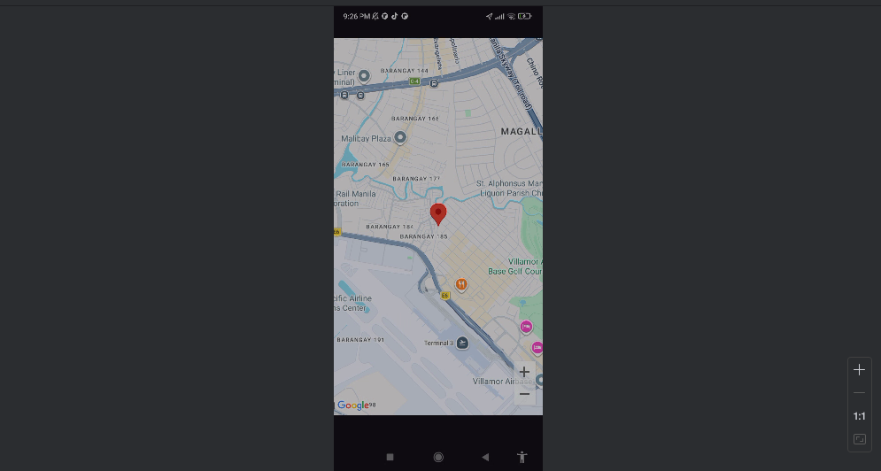

# Simple Location Tracker App

A mobile application that displays the user's live GPS location on a map using the device's location services.

## 🔐 Permissions Used

This app requires the following location permissions:

- **`ACCESS_FINE_LOCATION`** - Provides precise GPS location data for accurate positioning
- **`ACCESS_COARSE_LOCATION`** - Provides approximate location data as a fallback option

## 📸 Screenshots

### Permission Request

### Map Location Display

### Location Updates

## 🏗️ Technical Architecture

### Core Components:
- **`MainActivity`**: Handles app lifecycle and location manager initialization
- **`MapScreen`**: Jetpack Compose UI with Google Maps integration
- **`LocationManager`**: GPS tracking service with permission handling

